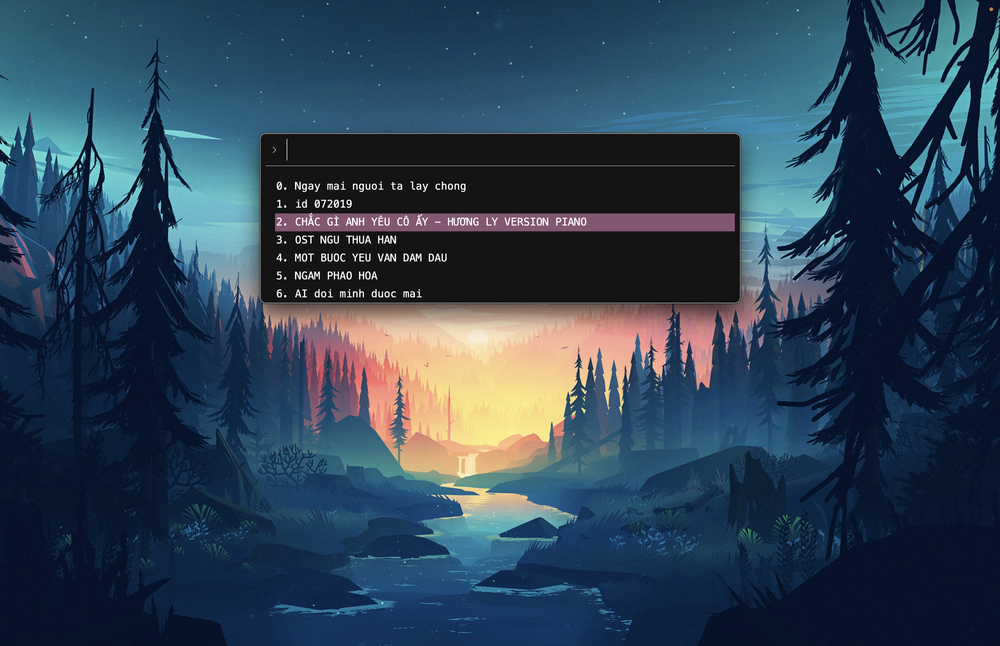
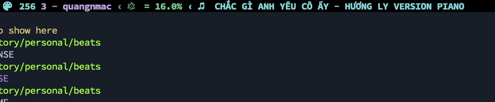

# Radio-beats
A rofi-like menu for playing radio stations on MacOS.



# Why?
- You can summon this radio poup from anywhere using [skhd](https://github.com/koekeishiya/skhd)
- Enjoy without youtube ads

## Dependencies
- choose-gui (rofi/dmenu style menu for MacOS)
- mpv (command-line video player)

## Installation

1. Download the dependencies with Homebrew.
```bash
brew install choose-gui mpv
```

2. Now clone this repository and give the script executable permissions:

```
$ git clone https://github.com/quangnguyen30192/radio-beats
$ cd radio-beats
$ chmod +x radio-beats
```

3. Add your radio database: create a music.csv file
```csv
Name, Link
Ngay mai nguoi ta lay chong,https://www.youtube.com/watch?v=WL11bwvAYWI&list=RDWL11bwvAYWI&start_radio=1
id 072019,https://www.youtube.com/watch?v=leJb3VhQCrg
CHẮC GÌ ANH YÊU CÔ ẤY - HƯƠNG LY VERSION PIANO,https://www.youtube.com/watch?v=LR0qtcldQ6M
OST NGU THUA HAN,https://www.youtube.com/watch?v=Lgahj5-7fDI
MOT BUOC YEU VAN DAM DAU,https://www.youtube.com/watch?v=6i41YbU4QuA,
NGAM PHAO HOA,https://www.youtube.com/watch?v=oDCB-9Fy05Y
AI doi minh duoc mai,https://www.youtube.com/watch?v=sNRnMqDl74M
```

4. Link your music.csv to the script
```
#!/bin/bash
DATABASE="$HOME/dev/music.csv"
```

5. Now the script is ready to use!

```
./radio-beats
```

## Linux 🐧

The linux version of this script is pretty much identical, replacing `notifications` function with `notify-send`, and `choose-gui` with `rofi`

## Extra Tips 📝
- I'd highly recommend linking this script to a keybinding, using a tool such as [skhd](https://github.com/koekeishiya/skhd) or [sxhkd](https://github.com/baskerville/sxhkd) on linux.
e.g my skhd config
```
cmd + shift - m :~/.yadr/bin/radio-beats
```
Now you could get your radio-beats up from anywhere

- The menu highlight color can be customized by changing the hex value in the `choose` command preceded by the -b argument (default is set to 'ff79c6').
- The menu width can be changed my modifying the value after the -w tag of the `choose` command.
- you could extend the script to get tmux or your status bar keeps track what song is playing


